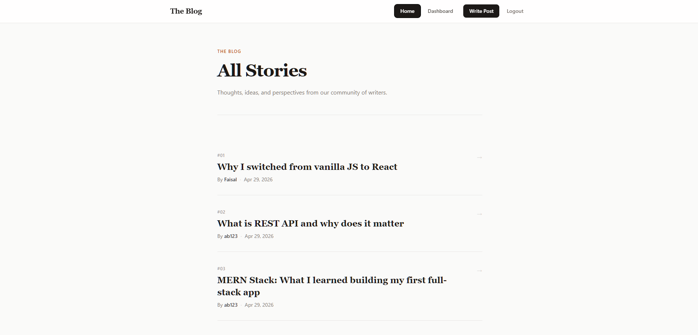

# Blog Platform - Frontend

React frontend for the Blog Platform app. Built with React, Vite, and Tailwind CSS.

## Features

- View all published posts on the home page
- Read individual posts with author and date
- Register and log in with JWT authentication
- Protected dashboard to manage your own posts
- Create, edit, and delete your posts
- Character count on the post editor
- Toast notifications for actions
- Redirects unauthenticated users away from protected routes

## Tech Stack

React, Vite, React Router, Tailwind CSS, React Hot Toast

## Folder Structure

├── src/
│   ├── components/     # Navbar, ProtectedRoute
│   ├── pages/          # Home, Login, Register, Dashboard, CreatePost, EditPost, SinglePost, NotFound
│   ├── App.jsx
│   └── main.jsx
├── public/
├── .env
└── index.html

## Pages

- `/` - All published posts
- `/login` - Sign in
- `/register` - Create account
- `/dashboard` - Your posts (protected)
- `/create` - Write a new post (protected)
- `/edit/:id` - Edit a post (protected)
- `/post/:id` - Read a single post

## Setup

1. Clone the repo
2. Run `npm install`
3. Create a `.env` file in the root:
VITE_API_URL=https://your-backend-url.vercel.app
4. Run `npm run dev`

## Deployment

Deployed on Vercel. Set `VITE_API_URL` in Vercel environment variables.